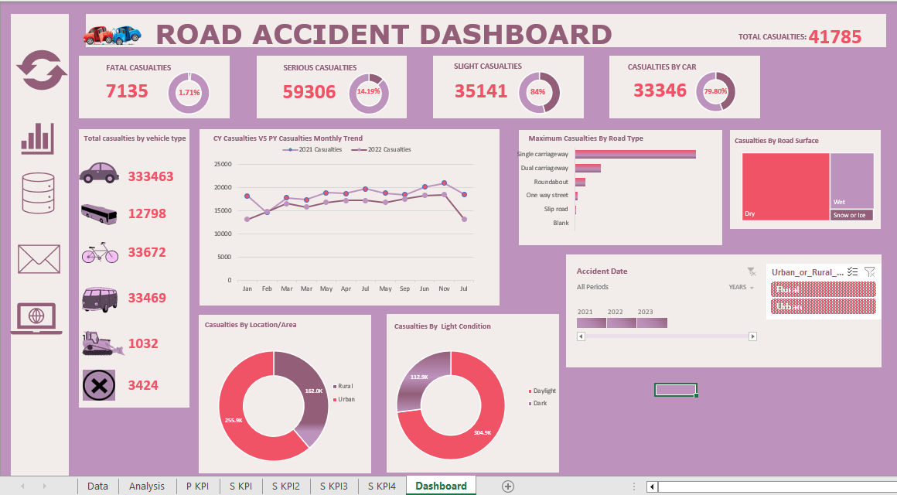

# RoadAccidentAnalysis

## Introduction
This is a dashboard that shows the analysis of road accidents for year 2021 and 2022.

# Primary KPIs:
1. Total casualties taken place after the accidents.
2. Total casualties and percentage of total with  respect to accident severity and maximum casualties by type of vehicle.

# Secondary KPIs:
1. Total Casualties with respect to vehicle type.
2. Monthly trend showing comparison of casualties for Current Year and Previous Year.
3. Maximum Casualties by Road Type.
4. Distribution of total casualties by Road Surface.
5. Relation between Casualties by Area/Location & by Day/Night.

Reference:
https://youtu.be/aw3AlfXr-IQ?si=1ffn-eMRuKwsp0u4
